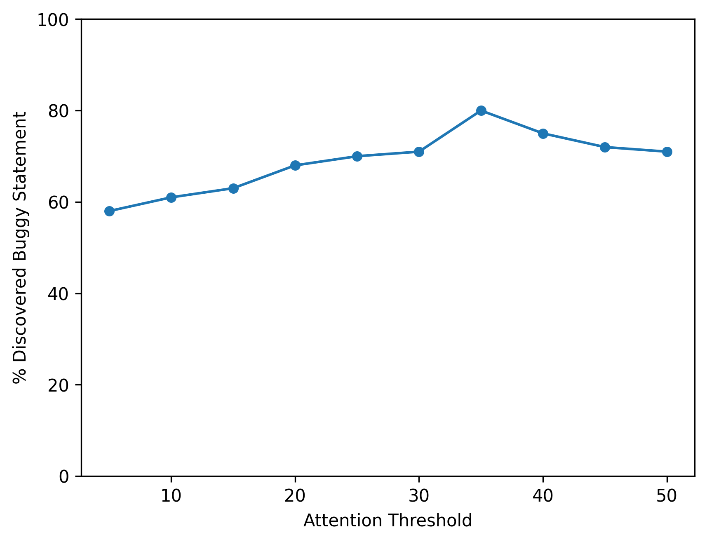
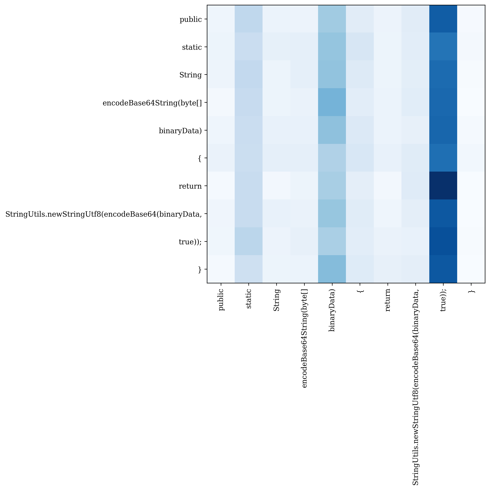
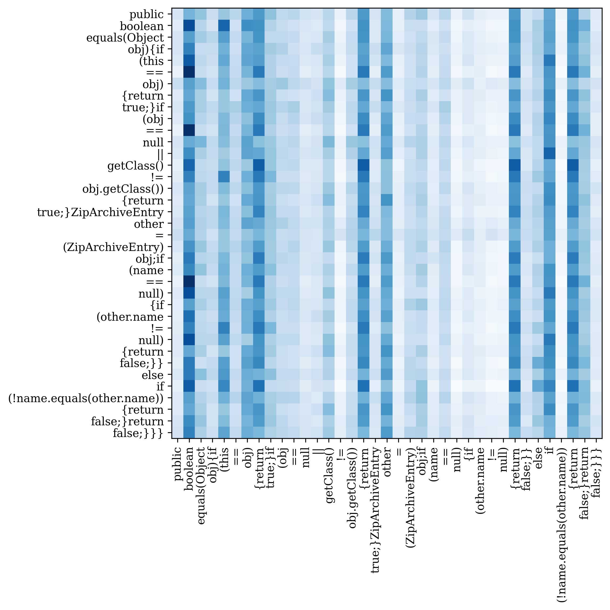
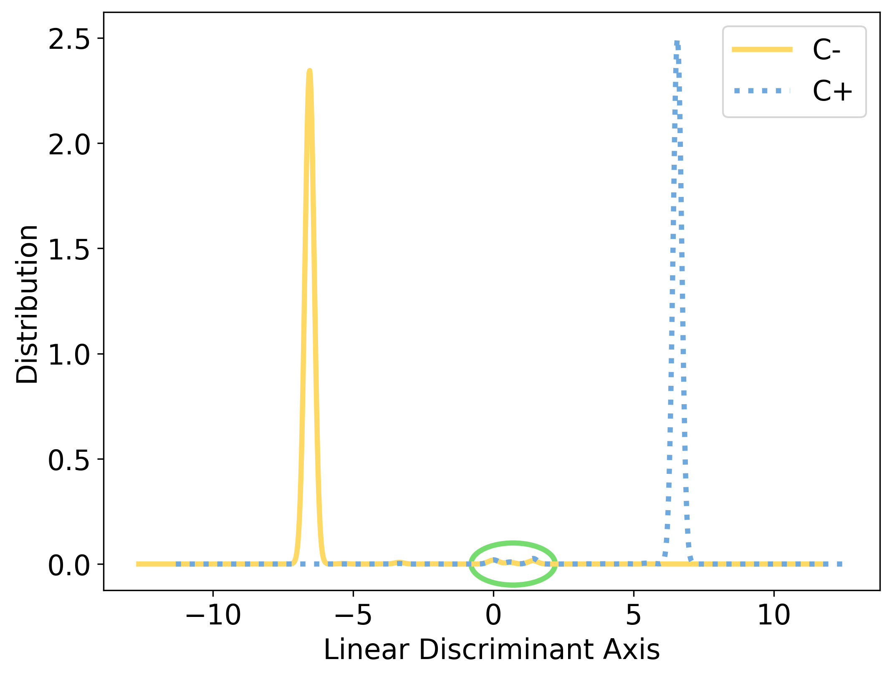

# Reproducing Results in the Paper
In this section, we will reproduce our results from the paper. This section has a directory called `data` which mainly contains the test data and model predictions. The script which reproduces results is called `main.py`. Please checkout each Research Question for specific details on how to run this script. You need to download the `data.zip` file from Zenodo and move the `data` directory inside `scripts` directory.

## RQ1: Effectiveness
In this research question, we will reproduce the main results mentioned in `section 5.2` of the paper. Please execute the following script to reproduce evaluation metrics and `Table 2`:

`python3 main.py --RQ 1`

Once executed successfully, you should be able to see an output like the following:

```
Subjects             TP (%)     FN (%)     TN (%)     FP (%)    

Math                 93.83      6.17       89.98      10.02     
Compress             92.53      7.47       98.18      1.82      
JacksonDatabind      100.0      0.0        30.77      69.23     
Lang                 81.07      18.93      92.6       7.4       
Closure              98.36      1.64       80.56      19.44     
Chart                94.74      5.26       88.03      11.97     
Codec                79.12      20.88      99.58      0.42      
Csv                  94.59      5.41       98.21      1.79      
Jsoup                98.81      1.19       0.0        100.0     
JxPath               100.0      0.0        25.0       75.0      
Gson                 100.0      0.0        66.67      33.33     
JacksonCore          97.06      2.94       41.94      58.06     
Cli                  96.23      3.77       60.0       40.0      
Time                 100.0      0.0        0.0        100.0     
JacksonXml           100.0      0.0        0.0        100.0     
Mockito              100.0      0.0        0.0        100.0     

Total                93.63      6.37       92.77      7.23      

Accuracy  : 93.0      
Precision : 86.0      
Recall    : 94.0      
F1        : 90.0
```

## RQ2: Generalization
In this research question, we will reproduce the main results mentioned in `section 5.3` of the paper. Please execute the following script to reproduce the evaluation metrics:

`python3 main.py --RQ 2`

Once executed successfully, you should be able to see an output like the following:

```
Subjects             TP (%)     FN (%)     TN (%)     FP (%)    

Cli                  76.81      23.19      10.71      89.29     
Closure              82.85      17.15      4.45       95.55     
Collections          66.67      33.33      100.0      0.0       
Csv                  89.86      10.14      0.0        100.0     
Gson                 75.7       24.3       10.8       89.2      
JacksonCore          59.08      40.92      47.35      52.65     
JacksonDatabind      85.88      14.12      14.74      85.26     
JacksonXml           98.28      1.72       21.74      78.26     
Jsoup                86.33      13.67      12.61      87.39     
JxPath               59.56      40.44      78.57      21.43     
Mockito              86.89      13.11      10.26      89.74     
Time                 85.3       14.7       21.5       78.5      

Total                81.55      18.45      14.11      85.89     

Accuracy  : 67.0      
Precision : 77.0      
Recall    : 82.0      
F1        : 79.0 
```

## RQ3: Interpretation
In this section, we will reproduce both Attention Analysis (`section 5.4.1`) and Embedding Analysis (`section 5.4.2`) from the paper.

* To begin with, please run the following in order to reproduce `figure 8` from the paper. We have executed `attention_analysis/main.java` using `attention_analysis.zip` from Zenodo in order to find the value of points in the plot.

    `python3 main.py --RQ 3 --subsec attn_threshold`

    If the script runs properly, a file named `attention_threshold.png` file will be automatically saved inside `scripts`. Below is a sample plot after a successful execution:

    <p align="center">
        
    </p>

* Moreover, please run the following in order to reproduce `figure 9` and `figure 10` from the paper. We have used the available attention weights of two code snippets from `attention_analysis.zip -> TNs_attn_weights` from Zenodo. The file names of two code snippets are `test1522.txt` and `test2988.txt`.

    `python3 main.py --RQ 3 --subsec attn_weights`

    If the script runs properly, two files namely `attn_weights_test1522.png` and `attn_weights_test2988.png` should be created inside `scripts`. Below is a sample plot for both files after a successful execution:

    <p align="center">
        
        
    </p>

* Finally, please run the following in order to reproduce `figure 11` from the paper. We have used the available embedding values from `embedding_analysis` component of SEER.

    `python3 main.py --RQ 3 --subsec embeddings`

    If the script runs properly, a file named `fig_embeddings_lda.png` should be automatically created inside `scripts`. Below is a sample plot after a successful execution:

    <p align="center">
        
    </p>


## RQ4: Performance
Calculating the performance of the model is a very trivial task, therefore we did not write any script for reproducing it.
